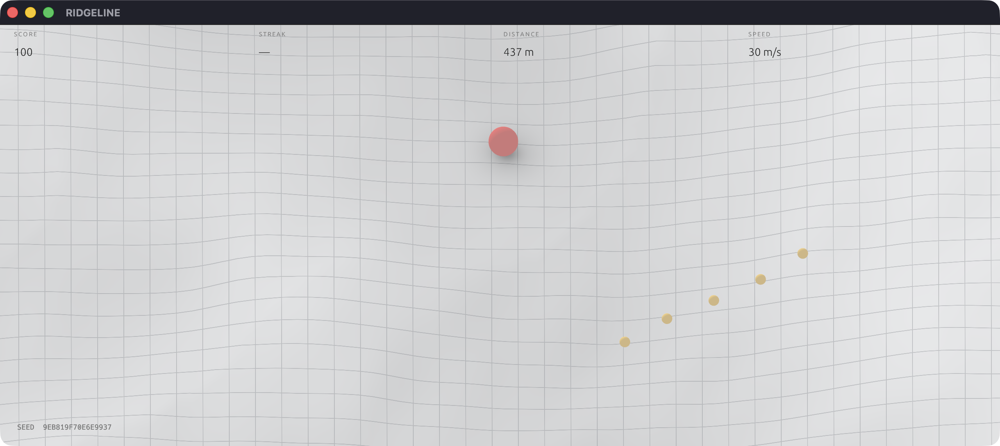
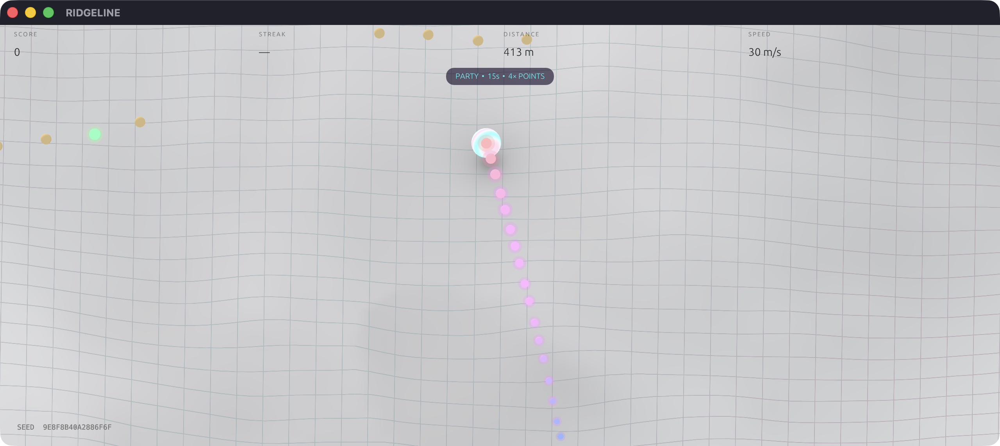
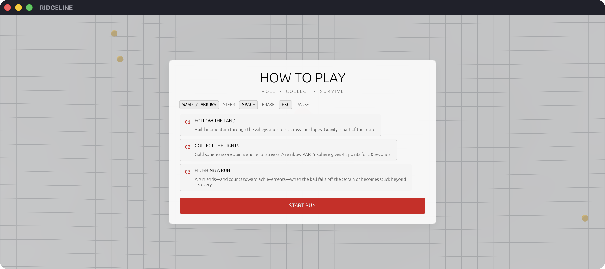
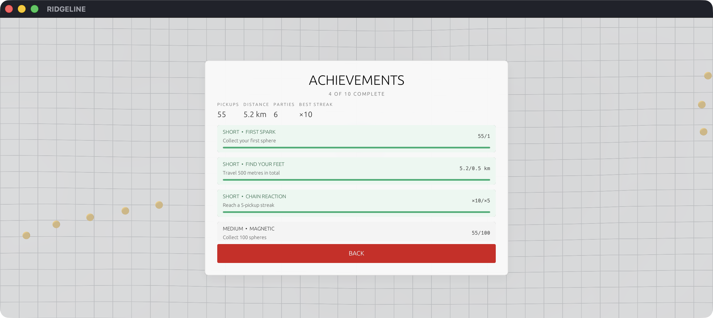
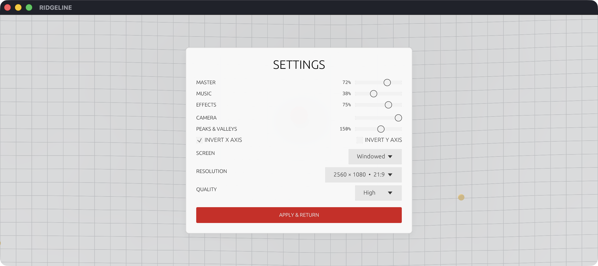

<p align="center">
  <strong>RIDGELINE</strong><br>
  <sub>Version 1.0.0 · Momentum, drawn in lines.</sub>
</p>


RIDGELINE is a minimalist native 3D arcade game about guiding a rolling sphere across an endless procedural wireframe landscape. Read the terrain, carry momentum through its valleys, collect lights, and keep the run alive for as long as possible.

The game is written in Rust and rendered with `wgpu`. Terrain, physics, collectible routes, and progression are generated and simulated locally without a game engine.

## Highlights

- Endless deterministic terrain with seamless background streaming.
- Force-driven sphere handling with persistent Precision, Responsive, and Momentum presets.
- High-oblique orthographic camera matched to the original visual reference.
- Classic, Vaporwave, and Dark terrain identities with distinct procedural forms, materials, and framing.
- A 38-track original soundtrack with embedded cover artwork, ordered or shuffled playback, and smooth crossfades.
- Soft terrain-following contact shadow for a clear grounded/airborne read.
- Rare PARTY pickups with 30 seconds of 4× scoring, a vaporwave player, and an RGB trail.
- Run-long terrain trails with subtle Smoke, Graphite, Neon, and Prism cosmetics plus optional mesh imprinting.
- Sparse seeded tears with dark recessed interiors and animated RGB warning rims.
- Persistent short-, medium-, and long-term achievements.
- Keyboard and gamepad support with independent X/Y inversion.
- Windowed and borderless presentation, including native **2560 × 1080 (21:9)** support.

<table>
  <tr>
    <td width="50%"></td>
    <td width="50%"></td>
  </tr>
  <tr>
    <td align="center"><sub>Read the hills, preserve momentum, collect the route.</sub></td>
    <td align="center"><sub>PARTY keeps the terrain legible while the player goes vaporwave.</sub></td>
  </tr>
</table>

## Run the game

Install the current stable Rust toolchain, then from the repository root run:

```sh
cargo run --release
```

RIDGELINE targets macOS first through Metal. The `wgpu` renderer also supports Windows and Linux graphics backends. Audio and gamepad initialization are optional at runtime, so the game continues if either device is unavailable.

## How to play

| Action | Keyboard | Gamepad |
| --- | --- | --- |
| Steer | WASD or arrow keys | Left analogue stick |
| Jump | Space | South face button |
| Pause / resume | Escape | Start |

Movement is camera-relative. Input adds acceleration rather than assigning velocity, so gravity, slopes, speed, and steering authority all shape the route.
The default **Responsive** feel has extra launch torque and more direct high-speed steering.
**Precision** trades pace for stronger grip and control; **Momentum** raises the speed ceiling and
reduces rolling drag for longer, more committed lines.

A run ends—and counts toward achievement progress—when the ball's underside overlaps one of the
renderer-confirmed dark tears. Their shimmering RGB rims make every hazard conspicuous. Non-tear
terrain contact is unconditionally solid. The first run presents a compact tutorial, and
**How to Play** remains available from the main menu.



## PARTY

Approximately 5% of collectible spawns are rainbow PARTY spheres. Collecting one starts a 30-second power-up:

- All pickups award 4× points.
- The player becomes a luminous vaporwave sphere.
- A fading RGB trail records the line of motion.
- The neutral terrain palette and contact shadow remain visible.
- Pausing also pauses the PARTY timer.

## Original soundtrack

RIDGELINE includes 38 numbered tracks by **ArtfulExpCHC**, played in numeric filename order by
default. The Settings menu can shuffle the gameplay sequence. Tracks crossfade over 3.2 seconds,
and a restrained bottom-corner card shows the embedded cover, title, artist, and playlist position.

**Haunted Heartbeats 1.1** is the dedicated menu theme. Starting a run moves into the ordered or
shuffled soundtrack; pausing and completing a run preserve the current gameplay track, while
returning to the menu fades back to the theme.

## Surface trails

Every grounded movement can leave a run-long mark on the generated landscape. The Settings menu
offers subtle **Smoke** particles, **Graphite**, **Neon**, and **Prism** trail identities, plus **Off**. PARTY's animated RGB
trail layers over the selected surface trail rather than replacing it.

The optional **Tessellated Surface Imprint** uses the visible run history to depress nearby terrain
vertices beneath the cosmetic marks. This is deliberately visual-only, so collectible routes and
the deterministic physics heightfield remain identical across cosmetic choices. Trail styles use
stable serialized identifiers, leaving a clean extension point for future unlockable or purchasable
cosmetic packs.

## Visual styles

The default **Classic** style preserves RIDGELINE's neutral white contour landscape. **Vaporwave**
uses a pearl player, cyan/magenta grid light and genuinely broader, taller procedural hills.
**Dark** builds more extreme warped banks and channels, then lowers and lengthens the camera angle
to expose their silhouettes against a charcoal world. The selected style is saved, and each style
uses the same deterministic physics/render heightfield so the visible surface and collision remain
in agreement.

## Progression

Ten saved achievements cover first-session goals, lifetime pickups and distance, streaks, finished runs, and PARTY discoveries. Progress, records, control preferences, graphics quality, terrain intensity, and display settings persist between sessions.



## Display and accessibility

The Settings screen provides:

- 1280 × 720, 1280 × 800, 1440 × 900, 1920 × 1080, and **2560 × 1080 (21:9)**.
- Windowed or borderless display modes.
- Independent invert X and invert Y controls.
- Precision, Responsive (default), and Momentum ball-feel presets.
- Classic (default), Vaporwave, and Dark visual styles with style-specific terrain and cameras.
- Camera follow, a 72–155% terrain-view zoom range, and master/music/effects volume.
- Ordered or shuffled playback for the 38-track soundtrack.
- Low, medium, and high terrain mesh quality.
- Peaks & Valleys intensity from 60% to 260%, with a reference-like 200% default.
- Smoke, Graphite, Neon, Prism, or disabled run-long surface trails.
- Optional tessellated surface imprinting beneath trail marks.

Settings are also available directly from Pause. Audio, controls, display, camera, ball feel,
quality, trails, and Peaks & Valleys changes return to the same paused run without resetting its
score or distance. Visual Style is the exception because each theme changes terrain topology and
gameplay: selecting a different style presents an explicit same-seed restart warning first.



Factory defaults use the centred 2560 × 1080 (21:9) window, 40% master volume, 30% music, 75%
effects, 124% camera zoom, 215% terrain intensity, Responsive ball feel, Classic visuals, the Smoke
surface trail, enabled tessellated imprinting, invert X enabled, and invert Y disabled. The former
1280 × 800 factory value migrates once to ultrawide; resolutions deliberately selected afterward
remain authoritative.

## Project layout

```text
src/
├── main.rs              window lifecycle, fixed-step loop, persistence wiring
├── game.rs              run state, camera, scoring, PARTY, particles, trail
├── physics.rs           custom swept heightfield sphere controller
├── terrain.rs           procedural field, chunks, streaming, collectibles
├── render/mod.rs        wgpu renderer, terrain and instanced sphere passes
├── shaders/             WGSL terrain and sphere materials
├── ui.rs                HUD, tutorial, menus, settings, achievements
├── input.rs             keyboard and gamepad input
├── audio.rs             soundtrack catalog, metadata, crossfades, movement and event audio
├── persistence.rs       settings, records, and achievement progress
└── config.rs            central gameplay and presentation tuning
music/                   numbered soundtrack MP3s with embedded metadata and cover artwork
```

The terrain is an analytic heightfield sampled by both rendering and physics. Visual chunks are
cached meshes, while collision continues to query the underlying field directly, keeping chunk
seams smooth and high-speed contact predictable. Deterministic tear masks remove selected surface
triangles and contact regions together, with recessed render-only chasm geometry beneath them.

## macOS application

The packaged Apple-silicon application is available at
[`dist/macos/RIDGELINE.app`](dist/macos/RIDGELINE.app), with a metadata-clean
[`RIDGELINE-macOS-arm64.zip`](dist/macos/RIDGELINE-macOS-arm64.zip) alongside it. The ZIP is the
recommended copy for transfer out of a synced source folder. It is ad-hoc signed for local launch
and requires macOS 12 or newer.

Three complete icon families are included: **Classic** (default), **PARTY**, and **Contour**. Rebuild
the app with any choice using:

```sh
./scripts/package_macos.sh classic
./scripts/package_macos.sh party
./scripts/package_macos.sh contour
```

See the [icon gallery and selection notes](assets/icons/macos/README.md). The release bundle is
self-contained; terrain, shaders, soundtrack, cover artwork, UI, and saves require no adjacent
source files.

## Verification

```sh
cargo fmt --all --check
cargo test
cargo clippy --all-targets -- -D warnings
cargo build --release
```

The test suite covers deterministic generation, seamless chunk borders, collectible accessibility
and PARTY rarity, sparse safe-start tears, cross-quality tear visibility, reported-seed long runs,
renderer-gated fall arming, neutral-input drag, jumping, live relief changes that preserve an
active run, peak/trough separation, profile-specific relief and bank tuning, sphere clearance,
permanent and PARTY trails, achievement derivation, and save compatibility.

## Gallery and technical notes

The [complete visual guide](docs/README.md) contains every major 21:9 game state, architecture notes, tuning references, and screenshot reproduction commands.

## Creator links and licensing

- [Support RIDGELINE](https://buymeacoffee.com/CHCOfficial)
- [Code — CHCOfficial on GitHub](https://github.com/CHCOfficial)
- [Graphics — CHCOfficial on DeviantArt](https://www.deviantart.com/chcofficial)
- [Audio — ArtfulExpCHC on Suno](https://suno.com/@artfulexpchc)
- Theme inspiration — **@chrislakin**

The source code is free to use under the attribution terms in [`LICENSE`](LICENSE), and the links
above must remain with copies and derivatives. Copyright and all other rights to the supplied
audio, embedded cover artwork, application icons, screenshots, and graphic assets are reserved by
CHCOfficial.
