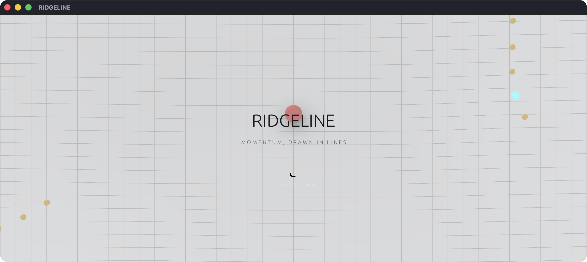
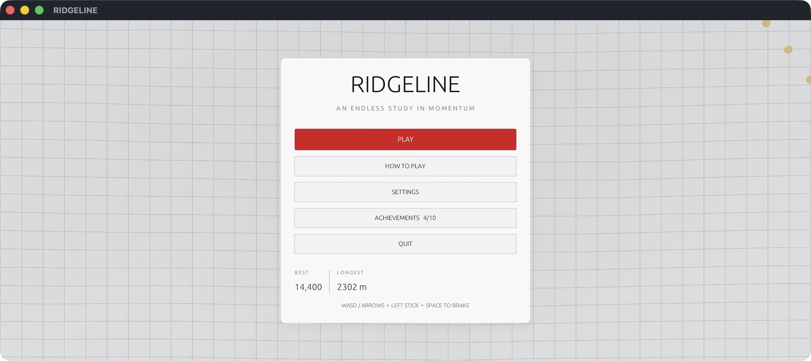
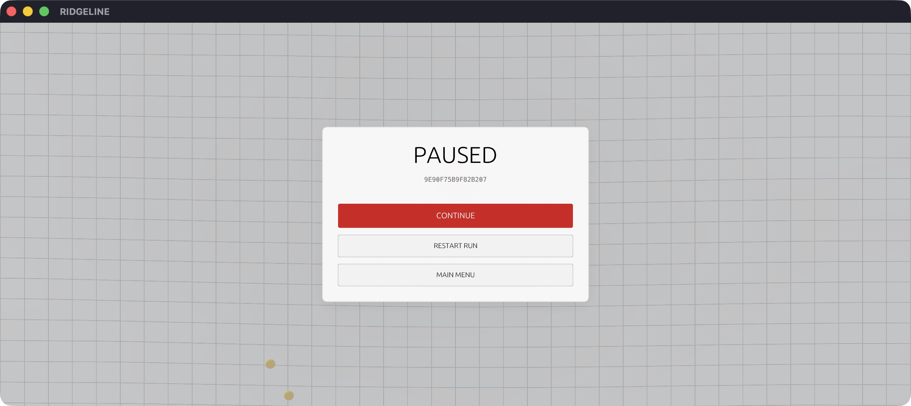
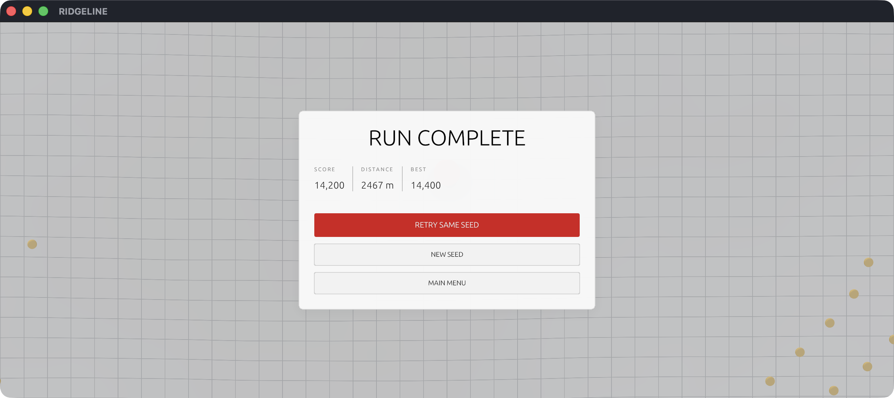

# RIDGELINE visual guide

This guide is the local, screenshot-led companion to the GitHub-facing [project README](../README.md). Every image below was captured from the release build with the game set to **2560 × 1080 (21:9)**. The title bar is retained so each image documents the complete native application window.

## Opening

The splash screen introduces the restrained visual language before the main menu presents play, tutorial, settings, achievements, and records.

| Splash | Main menu |
| --- | --- |
|  |  |

## Learning the game

The first-run tutorial explains steering, jumping, pickups, PARTY, and the run-ending conditions. It is also accessible later through **How to Play**.


## Normal gameplay

The high-oblique orthographic camera keeps the ball in the upper portion of the frame and exposes the terrain beneath it. Signed elevation lighting, slope shading, grid deformation, and the ball's soft contact shadow make peaks, valleys, and ground contact readable at a glance.


## Visual profiles and handling

Classic remains the default neutral presentation. Vaporwave changes both material and generation:
its hill wavelengths are broader and its relief is amplified under a cyan/magenta contour grid.
Dark adds a warped signed-bank layer, stronger ridge shaping and a lower, longer camera for the
sweeping charcoal channels suggested by the Contour app icon. These are terrain profiles, not
post-process filters.

The persistent Ball Feel selector offers Responsive (default, higher initial torque), Precision
(lower cap, stronger grip and steering), and Momentum (higher cap and less drag).

## PARTY mode

A rare PARTY sphere awards 4× pickup points for 30 seconds. The player becomes a cycling vaporwave sphere with a fading RGB trail while the environment retains its neutral contrast.


## Music presentation

The native build reads title, artist, and cover artwork from each numbered MP3. A compact
bottom-corner now-playing card stays outside the central route and HUD. Gameplay tracks play in
numeric order unless Shuffle Music is enabled; transitions use overlapping 3.2-second fades.
**Haunted Heartbeats 1.1** is reserved as the menu theme.

## Run-long surface trails

Grounded movement is recorded on the landscape for the duration of the run. Smoke—the default—uses
tiny translucent particles, Graphite creates a restrained charcoal route, Neon creates a cyan
emissive line, and Prism assigns a color spectrum along the path. The optional tessellated imprint depresses nearby rendered terrain
vertices while leaving the analytic physics surface unchanged. Marks are indexed by terrain chunk,
so returning to an earlier area restores its trail without submitting the entire run to the GPU.

## Settings and progression

Settings and achievements are persistent. The display selector includes the applied 2560 × 1080 ultrawide mode alongside standard 16:9 and 16:10 resolutions.

| Settings | Achievements |
| --- | --- |
|  |  |

## Run states

Pausing freezes simulation and the PARTY timer. A run is recorded only after the ball's sampled underside overlaps a renderer-confirmed dark tear. Animated RGB rims keep every opening conspicuous, while ordinary terrain is unconditionally solid. The completion screen preserves the seed retry loop.

| Paused | Run complete |
| --- | --- |
|  |  |

## Resolution support

The display menu currently exposes:

| Resolution | Aspect | Intended use |
| --- | --- | --- |
| 1280 × 720 | 16:9 | Compact HD |
| 1280 × 800 | 16:10 | Default compact window |
| 1440 × 900 | 16:10 | Larger desktop window |
| 1920 × 1080 | 16:9 | Full HD |
| 2560 × 1080 | 21:9 | Ultrawide |

The orthographic projection derives its width from the live surface aspect ratio, so ultrawide mode expands horizontal terrain visibility without changing vertical scale or distorting the ball.

## Important tuning values

The main presentation and feel controls live in [`src/config.rs`](../src/config.rs):

- Physics: gravity, acceleration, grounded jumping, speed caps, and sphere clearance.
- Terrain: noise frequency, amplitude, safe starting radius, and chunk resolution.
- Camera: distance, height, framing offset, and orthographic view height.
- Scoring: collectible value and streak timing.

Player-facing ball feel, visual style, terrain intensity, surface-trail style and imprinting,
camera sensitivity, inversion, audio, quality, screen mode, and resolution live in the persistent
Settings screen.

## Reproducing the gallery

The release binary contains deterministic visual-QA flags for each major state:

```sh
cargo run --release -- --ultrawide --splash-preview
cargo run --release -- --menu-preview
cargo run --release -- --tutorial-preview
cargo run --release -- --settings-preview
cargo run --release -- --achievements-preview
cargo run --release -- --autoplay
cargo run --release -- --party-preview
cargo run --release -- --factory-preview --vaporwave-preview
cargo run --release -- --factory-preview --dark-preview
cargo run --release -- --pause-preview
cargo run --release -- --game-over-preview
cargo run --release -- --factory-preview --autoplay
```

`--ultrawide` selects windowed 2560 × 1080 and persists it. `--factory-preview` uses clean defaults
without reading or writing the player's save. Other preview flags only choose or freeze a
presentation state; regular launches retain the normal game flow.
